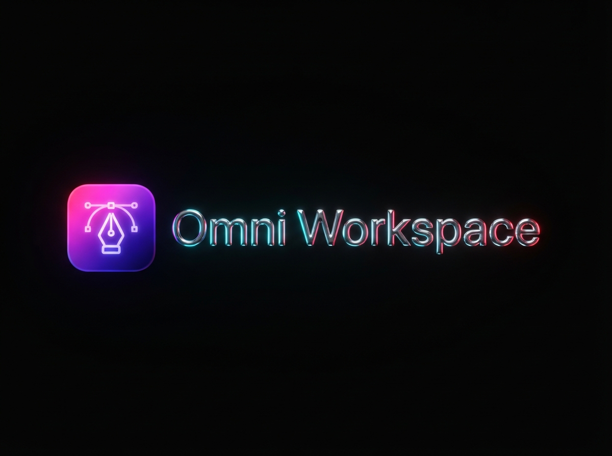

# 🚀 AI-PostGen (Omni Workspace)



Plataforma Desktop e Web completa para geração automatizada de conteúdo com IA, CRM visual com grafo de relacionamentos 2D/3D, agendamento de publicações, orçamentos profissionais (QuotePRO), transcrição inteligente do YouTube e Product Studio com inteligência artificial.

---

## 🌟 Principais Funcionalidades

### 🤖 1. IA Post Gen & Product Studio
- **Geração Multilíngue**: Criação de posts estruturados em 12 idiomas, com controle de tom, modo aprofundado e formato carrossel.
- **Product Studio**: Geração e edição assistida de vídeos e mídias de produto com IA generativa.
- **Integrações de IA**: Suporte nativo ao **Google Gemini 2.0** e **Hugging Face**.

### 👥 2. CRM Visual & Grafo de Relacionamentos
- **Diretório de Contatos & Empresas**: Organização completa por categorias (*Fundadores, Time, Clientes, Parceiros, Leads*).
- **Grafo 2D/3D Interativo**: Visualização gráfica com física de força, nós interativos, filtros por cidade, tags e intensidade de conexões.
- **Banco Híbrido**: Persistência local embutida (`.data/crm.json`) ou em nuvem com **PostgreSQL / Prisma ORM**.

### 🎬 3. Transcritor Inteligente do YouTube
- Extração de áudio e legendas em múltiplos formatos (**XML, SRV3 e WebVTT**).
- Resumos executivos e extração de insights gerados por IA a partir de vídeos e playlists.

### 💼 4. Orçamentos Profissionais (QuotePRO) & Web Scraping Pro
- **QuotePRO**: Criação, cálculo e exportação de propostas comerciais e orçamentos em PDF.
- **Web Scraping Pro**: Varredura inteligente de sites, extração de textos e referências de mercado.

### 📅 5. Calendário Editorial & Publicação
- Agendamento de posts, aprovação em workflow durável e publicação via Meta / Instagram Graph API.
- Notificações automáticas via bot do Telegram.

---

## 📦 Downloads & Instalação para Usuários Finais (Windows)

Você pode baixar os executáveis prontos na seção de [Releases do GitHub](https://github.com/ViniciusNoetzold/AI-PostGen/releases):

| Arquivo | Descrição |
| :--- | :--- |
| **`AI-PostGen-Setup.exe`** | **Instalador Oficial Windows**: Permite escolher a pasta de destino, definir a **Porta HTTP Local** personalizada e cria atalhos na Área de Trabalho e Menu Iniciar. |
| **`AI-PostGen-Portable-v1.0.0-windows-x64.zip`** | **Pacote Portátil Tudo-em-Um**: Descompacte e execute diretamente `AI-PostGen-Portable.exe` sem necessidade de instalação prévia. |

---

## 🔌 Escolha de Porta Personalizada

O AI-PostGen permite que você escolha a porta em que a aplicação vai rodar:

1. **No Instalador**: Durante a instalação, defina a porta desejada no campo *"Porta HTTP Local"* (Padrão: `3000`).
2. **Nas Configurações Web**: Acesse [http://localhost:3000/settings](http://localhost:3000/settings) e altere a porta no campo *"Porta HTTP Local"*.
3. **Por Linha de Comando**:
   ```bash
   AI-PostGen-Portable.exe --port 3005
   ```
*(Se a porta escolhida estiver ocupada por outro programa, o aplicativo seleciona automaticamente a próxima porta livre).*

---

## 🔑 Como Obter as Chaves de API (100% Opcional)

O AI-PostGen já vem pronto para uso com banco local e Obsidian Vault. Para habilitar recursos adicionais de IA e redes sociais, obtenha suas chaves:

| Serviço | Para que serve | Onde obter |
| :--- | :--- | :--- |
| **Google Gemini** | Geração de texto, temas e vídeos | [Google AI Studio (Gratuito)](https://aistudio.google.com/app/apikey) |
| **Hugging Face** | Modelos auxiliares e transcrições | [Hugging Face Tokens](https://huggingface.co/settings/tokens) |
| **Telegram Bot** | Alertas e notificações de posts | [@BotFather no Telegram](https://t.me/BotFather) |
| **PostgreSQL** | Banco de dados durável em nuvem | [Neon.tech](https://neon.tech/) ou [Supabase](https://supabase.com/) |
| **Meta / Instagram** | Publicação direta no Instagram | [Meta for Developers](https://developers.facebook.com/apps/) |

As chaves podem ser salvas com segurança na interface gráfica em **Configurações > Integrações do Servidor** ou no arquivo `.env.local`.

---

## 💻 Instalação para Desenvolvedores

### Pré-requisitos
- **Node.js** (v20 ou superior)
- **pnpm** (`npm install -g pnpm`)

### Passo a Passo

```bash
# 1. Clonar o repositório
git clone https://github.com/ViniciusNoetzold/AI-PostGen.git
cd AI-PostGen

# 2. Instalar dependências
pnpm install

# 3. Gerar o cliente do banco de dados
pnpm db:generate

# 4. Iniciar em modo de desenvolvimento
pnpm dev
```

Acesse **[http://localhost:3000](http://localhost:3000)** no seu navegador.

### Gerando os Executáveis Desktop (Windows)

Para compilar o Instalador (`AI-PostGen-Setup.exe`) e o Launcher Portátil (`AI-PostGen-Portable.exe`):

```bash
pnpm build:desktop
```

Os arquivos finais serão gerados na pasta `release/`.

---

## 🛠️ Scripts Disponíveis

```bash
pnpm dev             # Inicia o servidor Next.js em modo desenvolvimento
pnpm build           # Compila a aplicação para produção
pnpm start           # Inicia o servidor em modo produção
pnpm build:desktop   # Compila os executáveis Windows (Launcher + Setup + ZIP)
pnpm test            # Executa testes unitários (Vitest)
pnpm test:e2e        # Executa testes de interface (Playwright)
pnpm typecheck       # Validação estática com TypeScript
pnpm db:seed         # Popula o banco PostgreSQL a partir do .data/crm.json
```

---

## 📄 Licença

Distribuído sob licença proprietária/MIT. Desenvolvido por **Vinícius Noetzold & Mezzold Studio**.
